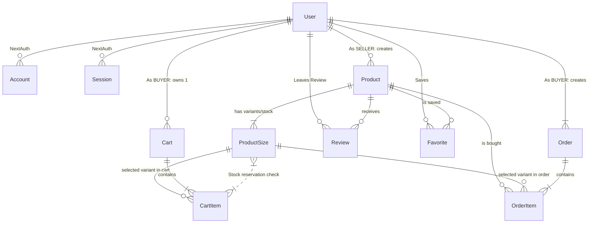

# 👟 Mundo Zapatería

Mundo Zapatería es un E-Commerce B2B/B2C completo desarrollado en **Next.js 14**, con motor de base de datos **PostgreSQL** orquestado nativamente mediante **Prisma ORM**, autenticación flexible a través de **NextAuth** y pagos integrados mediante **MercadoPago (Webhooks)**.

## 🚀 Requisitos y Configuración de VPS (Producción)
Este repositorio está diseñado para una estricta integración bajo la arquitectura de *Docker*.

1. En tu servidor, renombra `.env.example` a `.env`.
2. Completa los Keys (principalmente `NEXTAUTH_URL`, `NEXTAUTH_SECRET` y `MP_ACCESS_TOKEN`).
3. Dispara la malla de Contenedores y Base de Datos:
```bash
docker-compose up -d --build
```
> [!TIP]
> **Sobre Nginx (HTTPS)**: La aplicación expondrá la web en texto plano sobre `http://localhost:3000` de tu VPS. Usa Nginx configurando un `proxy_pass http://localhost:3000;` apuntando a tu subdominio público, y ejecuta certbot (Let's encrypt) sobre nginx para certificar tu web, lo cual es ineludible para que los Webhooks de pagos de Mercado Pago entren.

## 📋 Arquitectura de Rutas API

El sistema opera bajo una estrucutura lógica de permisos donde existen las vías Standard y Privadas de acuerdo al Rol del Usuario (`BUYER` vs `SELLER`).

| Ruta Principal | Métodos | Funcionalidad Core | Requisito Auth |
| :--- | :---: | :--- | :---: |
| `/api/auth/[...nextauth]` | POST, GET | Creador/Verificador de Sesiones de PrismaAdapter. | Abierta |
| `/api/profile` | GET, PATCH | Recuperación y Edición del nombre Público del Perfil. | Autenticado |
| `/api/products` | GET | Recuperación del motor de catálogo en Grid + Search Params. | Abierta |
| `/api/products/[id]`| GET | Recopilación Agregada individual (Stats Promediados). | Abierta |
| `/api/cart` | GET, POST, DEL | Lógica de Carrito Persistente ligada al Usuario y Stock. | `BUYER` |
| `/api/checkout` | POST | Gateway de MercadoPago Preference + Webhook linker. | `BUYER` |
| `/api/orders` | POST | Transacciones Atómicas (Limpieza carrito + Descuento Stock).| Sistema Interno |
| `/api/webhooks/mp` | POST | Notificaciones (IPN) de Pagos Aprobados. | Firma MP |
| `/api/reviews` | POST | Gestor de opiniones (Exige Order en estado `PAID`). | `BUYER` |
| `/api/seller/products`| CRUD | Motor administrativo del inventario propio (Por Vendedor).| `SELLER` |
| `/api/seller/stats` | GET | Dashboard de Analíticas en sumas de Ventas e Ingresos. | `SELLER` |


## 🗄 Modelo de Relaciones y Entidad (Prisma)

El siguiente modelo ilustra cómo logramos la coherencia financiera, impidiendo inyecciones de stock muerto al basar todas las conversiones directamente en la Entidad Intermedia **`ProductSize`** como Single Point of Truth.



## 🛠 Desarrollo Local
Para contribuir a nivel local sin Docker:
1. Asegúrate de tener Postgres ejecutándose (ej. a través de Supabase o local).
2. Modifica el `.env` correspondiente.
3. `npx prisma db push` (Inyecta las tablas).
4. `npm run dev` (Abre el proyecto localmente).

---
*Fin del Bootcamp E-Commerce*
